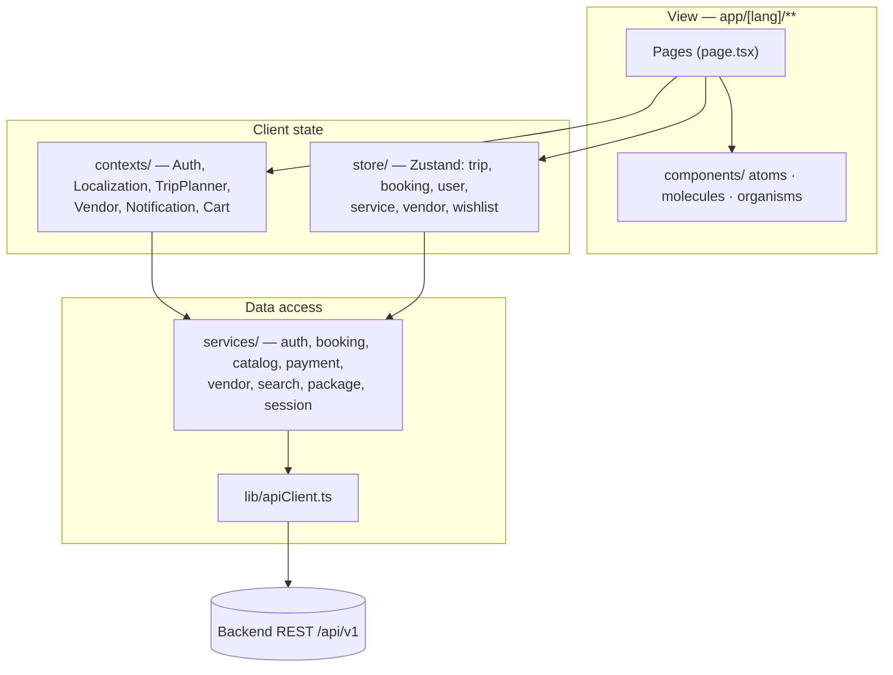
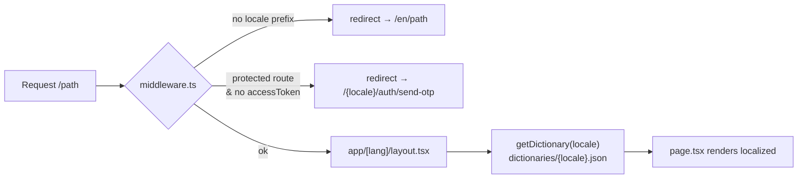
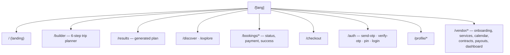
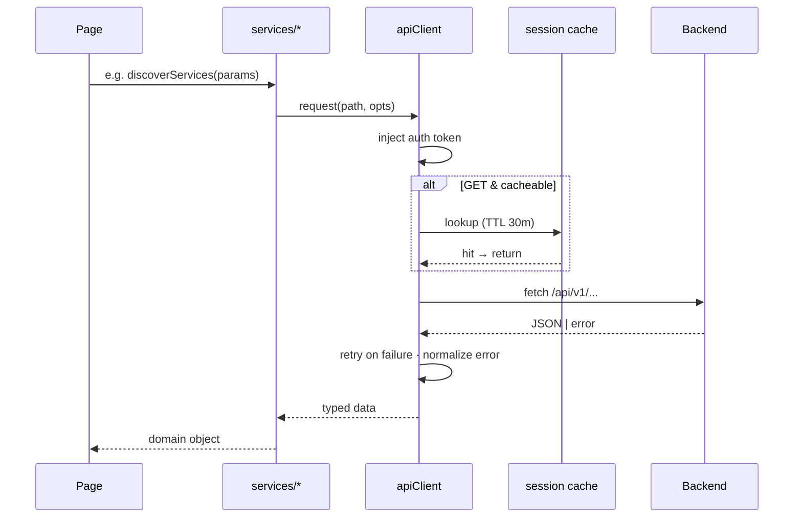
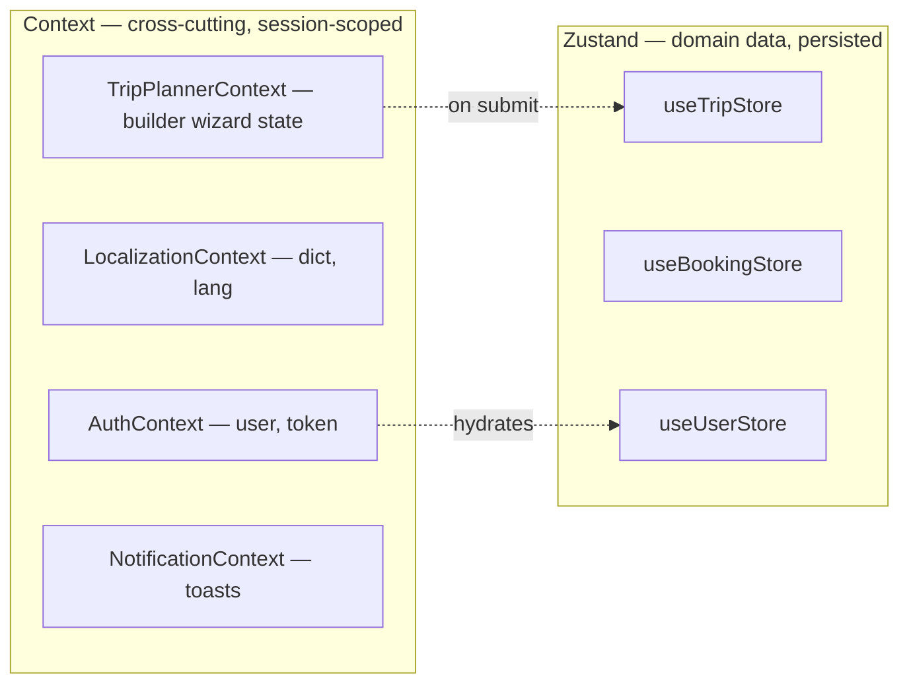

# Architecture

## Layered view

**Rule of thumb:** pages compose components and read state; only `services/*` talk to
`apiClient`; components never call the network directly.

## Routing & i18n

- Locales: `en · hi · he · de · fr · es` (default `en`), from `i18n-config.ts`.
- Every user-facing string comes from `dictionaries/*.json` via the Localization context.
- Protected prefixes: `/{locale}/profile`, `/dashboard`, `/vendor`.

## Route groups

## Request lifecycle through apiClient

## State: Context vs Zustand

Use **Context** for things every subtree needs (auth, language, active wizard).
Use **Zustand** for domain records that outlive a single screen (trip, bookings, user).
