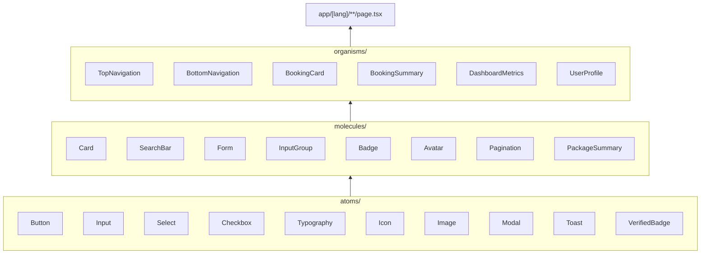
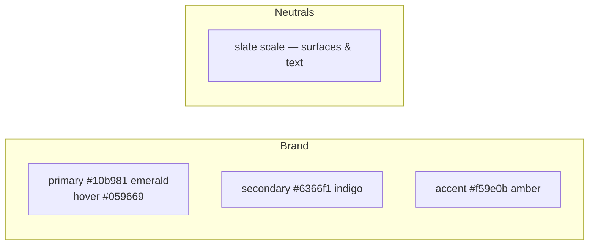
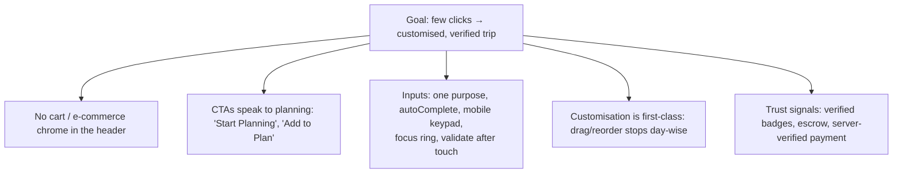

# Design System

Atomic design. Compose upward: **atoms → molecules → organisms → pages**.
A component never reaches "down" into a sibling's internals or "up" to the network.

## Tokens (Tailwind)

- **Primary action** = emerald. **Ink / surfaces** = slate. Keep accents rare.
- Rounded, soft-shadow cards; black uppercase italic display type for headings.
- All copy in `dictionaries/*.json`. **No em-dashes** in UI copy — use commas or periods.

## UX rules (portal, not a shop)

## Accessibility & mobile

- Tap targets ≥ 40px; sticky bottom actions on wizard steps.
- `aria-invalid` / `aria-describedby` on validated inputs; `role="alert"` on errors.
- Drag-and-drop always has a keyboard/tap fallback (▲ ▼ buttons).
- Theme-aware, responsive; wide content scrolls in its own container.
