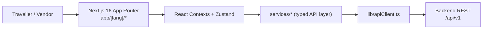

# Local Connect Portal — Docs

A trip **preparation portal**: a traveller does a few clicks, customises their route
and stops, and books verified local services. Not an e-commerce store — no cart,
no checkout-first flow. The goal is *plan, customise, book with trust*.

## Map of the docs

| Doc | What's inside |
| --- | --- |
| [ARCHITECTURE.md](./ARCHITECTURE.md) | Layers, routing, i18n, state, request lifecycle (diagrams) |
| [USER_FLOWS.md](./USER_FLOWS.md) | Traveller planning, auth, booking, vendor onboarding (flowcharts) |
| [DESIGN_SYSTEM.md](./DESIGN_SYSTEM.md) | Atomic component map, tokens, UX rules |

> Older thesis-style notes (implementation logs, roadmaps) were removed in favour of
> these visual docs. They remain in git history at commit `c2373d6` if ever needed.

## Stack at a glance

- **Framework:** Next.js 16 (App Router, RSC-ready), React 19
- **i18n:** `middleware.ts` + `dictionaries/*.json`, 6 locales (`en hi he de fr es`)
- **State:** React Context (session/UI) + Zustand stores (domain data)
- **Styling:** Tailwind CSS, atomic-design components
- **PWA:** `manifest.ts`, service worker, push notifications
