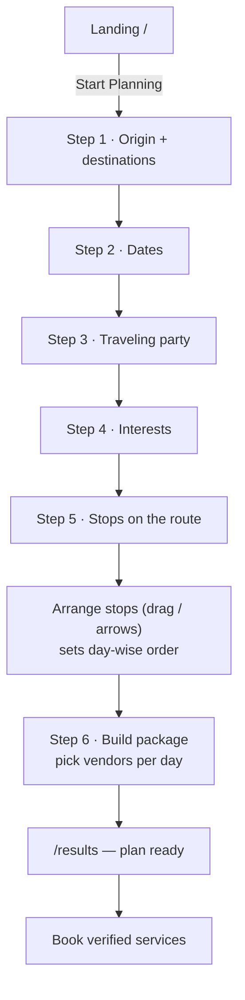
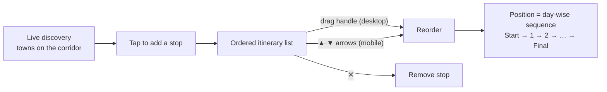
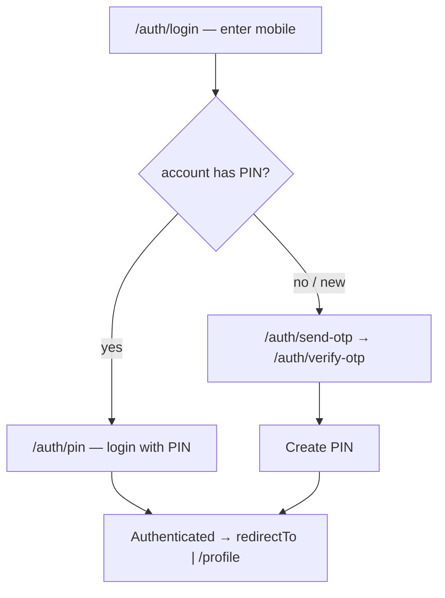
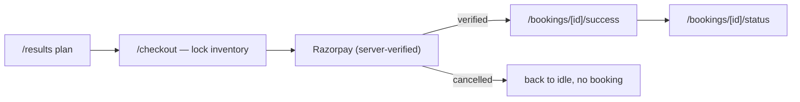
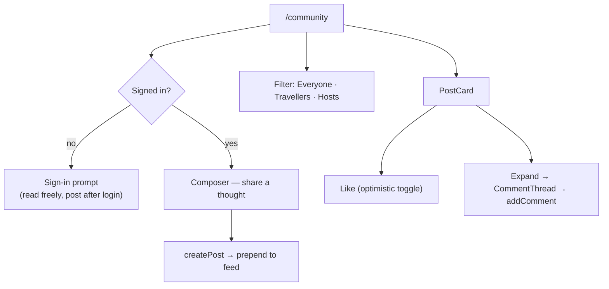
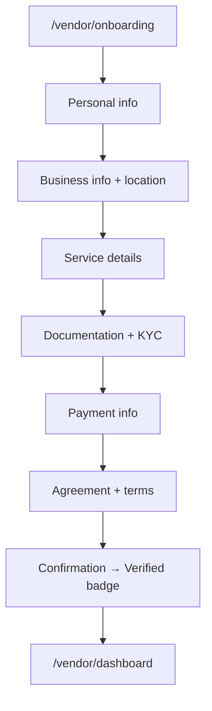

# User Flows

## Traveller: plan & customise a trip

The core promise — *a few clicks, a fully customised route with verified services*.

**Step 5 detail — customising stops:**

## Authentication

Input UX: single-purpose fields, `autoComplete`, numeric keypad on mobile,
focus ring, inline validation only after the field is touched.

## Booking & payment

> Payment is always verified server-side; the client never trusts the redirect alone.

## Community (travellers + vendors)

One shared feed. Travellers share tips and moments; verified hosts answer and post
updates. Role is derived from the signed-in user; posts and comments carry a role chip.

- Data: `services/communityService.ts` (in-memory store now; maps to `/community/*`).
- Reached from the bottom nav — Community tab for both travellers and vendors.

## Vendor onboarding

